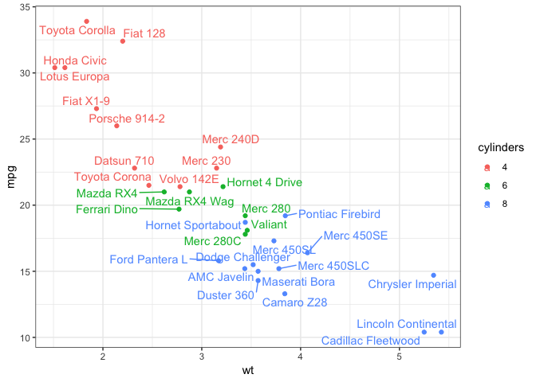
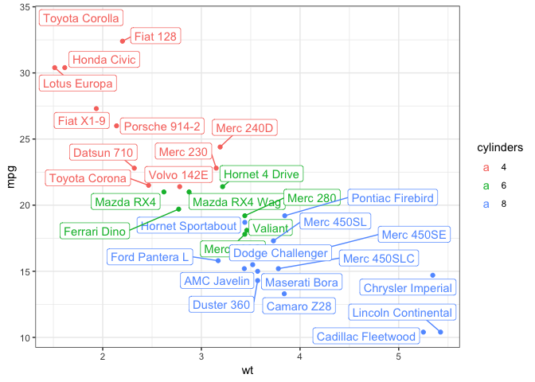
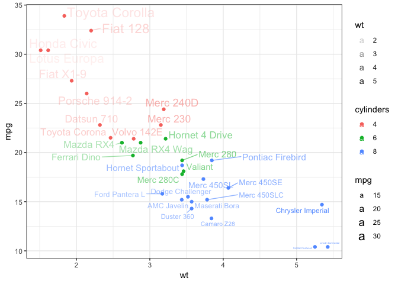
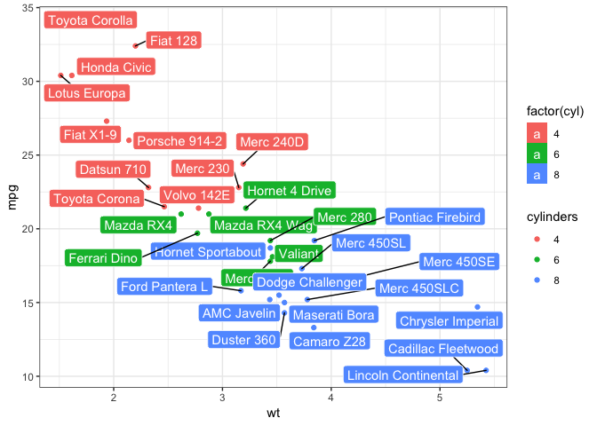

<!-- README.md is generated from README.Rmd. Please edit that file -->
ggformulaExtra
==============

ggformulaExtra provides some addiitonal functionality to ggformula. Typically, this functionality either

-   relies on additional packages beyond ggplot2, or

-   is "experimental"

Installation
------------

You can install ggformulaExtra from github with:

``` r
# install.packages("devtools")
devtools::install_github("ProjectMOSAIC/ggformulaExtra")
```

Example
-------

This is a basic example that uses `ggrepel` to solve a common problem -- text labels that overlap.

``` r
library(ggformulaExtra)
#> Loading required package: ggformula
#> Loading required package: ggplot2
#> 
#> New to ggformula?  Try the tutorials: 
#>  learnr::run_tutorial("introduction", package = "ggformula")
#>  learnr::run_tutorial("refining", package = "ggformula")
theme_set(theme_bw())

mtcars$model <- rownames(mtcars)
mtcars$cylinders <- factor(mtcars$cyl)

p <-
  gf_point(mpg ~ wt, data = mtcars, color = ~ cylinders)

# Avoid overlaps by repelling text labels
p %>% gf_text_repel(label = ~ model)
```



``` r

# Labels with background
p %>% gf_label_repel(label = ~ model)
```



``` r

# Add aesthetic mappings
p %>% gf_text_repel(alpha = ~ wt, size = ~ mpg, label = ~ model)
```



``` r
p %>% gf_label_repel(label = ~ model,
                     fill = ~ factor(cyl), color = "white", segment.color = "black")
```



More examples can be found in the package documentation.
